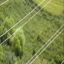

# ⚡ Powerline Detection for Rotary-Wing Aircraft

## 📌 Project Overview
This project presents a **real-time powerline detection system** aimed at increasing the safety of rotary-wing aircraft such as **helicopters and drones**.  
Electrical powerlines are among the most dangerous obstacles for low-altitude flights due to their **thin structure, poor visibility in certain weather conditions, and incomplete database records**.  

By leveraging **Convolutional Neural Networks (CNNs)**, this project achieves **~96% accuracy** in detecting powerlines from camera sensor images in real time.  
The system is designed to be **low-cost, accessible, and practical** for integration into lightweight aerial vehicles.

---

## 🎯 Objectives
- Detect electrical powerlines in **real time** across various backgrounds and weather conditions.  
- Provide a **cost-effective alternative** to existing high-cost detection systems.  
- Ensure compatibility with **drones and small-scale UAVs** for safety enhancement.  

---

## 📂 Dataset
- **Training Set:** 10,000 RGB images (128×128 resolution)  
  - 5,417 with powerlines  
  - 4,583 without powerlines  
- **Test Set:** 4,007 independent images (different from the training set)

The dataset covers **diverse environments and perspectives**, ensuring model robustness. 

.png)
.jpg

 

---

## 🧠 Model Architecture
The neural network was implemented in **TensorFlow** on Google Colab.  

- **Layers:** Conv2D → MaxPooling2D → Dropout → Flatten → Dense  
- **Optimizer:** RMSprop  
- **Loss Function:** Binary Cross-Entropy  
- **Epochs:** 50  
- **Batch Size:** 100  
- **Validation:** 1% of training data used  
- **EarlyStopping:** Applied to prevent overfitting  

✅ Final Accuracy: **96%**

---

## 🧪 Testing & Results
- **Image Testing:** Predictions made on unseen test images with a 0.5 threshold.  
- **Video Testing:** Detection performed on combined videos from multiple environments and weather conditions.  
- Results confirmed **high detection reliability** in real-world-like scenarios.  

---

## 📹 Demo
An application video showcasing **real-time detection** is included in the repository.

---

## 🚀 Future Improvements
- Integration with **object tracking** for smoother video analysis.  
- Deployment on **embedded devices** (e.g., Jetson Nano, Raspberry Pi).  
- Expansion with **higher-resolution and infrared/thermal images** for better detection in low visibility.  

---

## 👩‍💻 Authors
- Öykü Su Başaran  
- Nida Esen  

---

